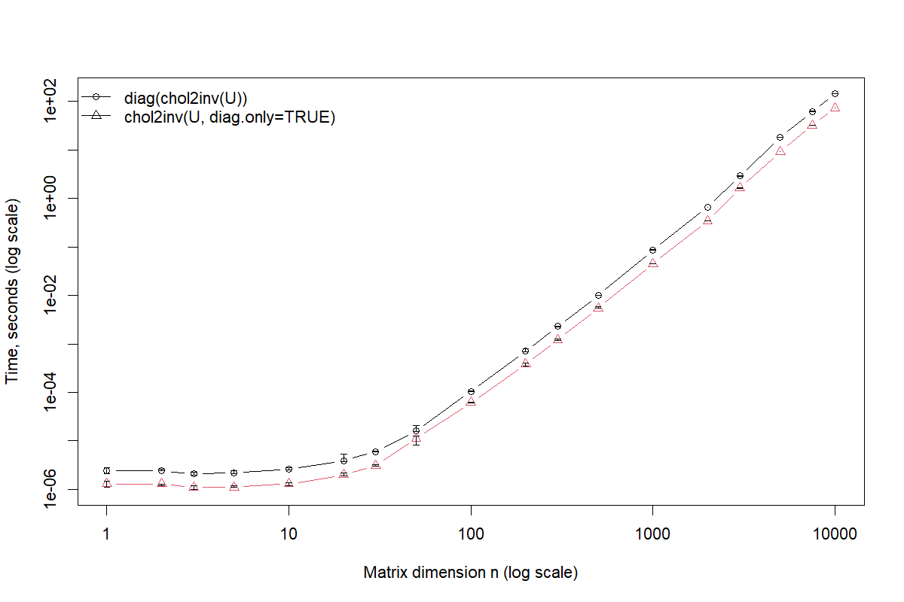
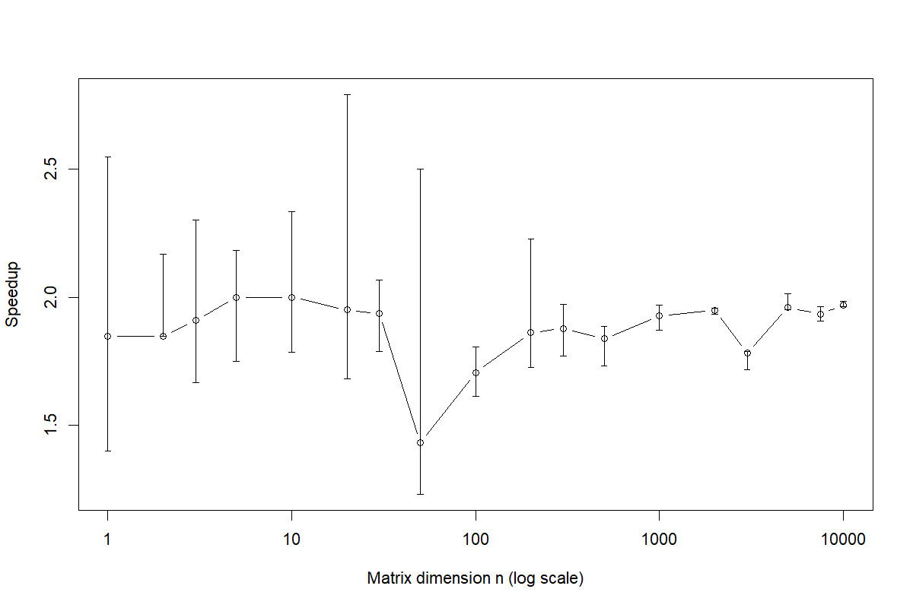

# Diagonal-only inverse from dense Cholesky factors
This is a brief description of a potential improvement of R's
`chol2inv()` when only the diagonal is needed.

For an upper-triangular Cholesky factor `U` with
```
A = t(U) %*% U
```
the diagonal of `A^-1` is obtained from the squared row norms of `U^-1`:
```
diag(A^-1)[i] = sum(Uinv[i, i:n]^2)
```

The current R `chol2inv()` uses LAPACK `DPOTRI`, which performs `DTRTRI`
followed by the full `DLAUUM` product. If we only need the diagonal, we
can replace the full `DLAUUM` with one BLAS `DDOT` per row. The initial
`DTRTRI` remains cubic, but the following work becomes quadratic.

This could be implemented in R as the following backwards-compatible interface:
```r
chol2inv(x, size = NCOL(x), LINPACK = FALSE, diag.only = FALSE)
```
The R-devel patch is in [`patch/chol2inv-diag-only.patch`](patch/chol2inv-diag-only.patch).
It was generated against R-devel SVN revision 90563.

## Current benchmark
On my local windows machine with R-devel & LAPACK 3.12.1, I tested dense factors
n=1, ..., 10000 with microbenchmark. The speedup was approximately 1.8-1.9x, resulting in
a reduction from ~144s to ~73 seconds at 10000 factirs.

The diagonal-only results are exactly identical to `diag(chol2inv(U))` for all factors tested.




Raw results in [`results/chol2inv_diag_benchmark.csv`](results/chol2inv_diag_benchmark.csv).

## Reproduce

Run the [`baseline_object_creation.R`] script before applying the patch to get create a baseline object.
Apply the patch to the corresponding R-devel source tree, rebuild R, then run:
[`test_identicality.R`]
[`chol2inv_diag_benchmark.R`]

`benchmark.R` uses the `microbenchmark` package and tests n_factors:

```
1, 2, 3, 5, 10, 20, 30, 50, 100, 200, 300, 500,
1000, 2000, 3000, 5000, 7500, 10000
```

## Existing uses

I searched github CRAN & base R for additional uses of similar code. This finds
multiple R packages explicitly using `diag(chol2inv(...))`, often for standard errors
or Hessian/QR calculations. Further, base R's `stats` code also contains cases where
`chol2inv()` is followed by use of only its diagonal. Whether these usecases are run on
large enough datasets to justify the improvement, I don't know - but it is relatively widely
used as far as I can tell.

With the GitHub CLI authenticated, the searches used here can be reproduced by:

```sh
./search-uses.sh
```
